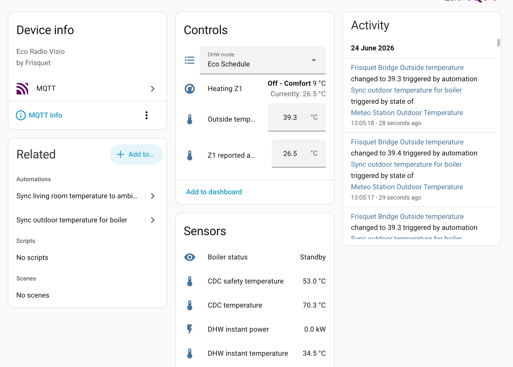

# frisquet-bridge

`frisquet-bridge` gives a Frisquet Eco Radio Visio boiler a local Home
Assistant interface. It uses a small RF modem and a Python service to publish
MQTT discovery entities and send boiler commands over the Frisquet radio link.

The main goal is a simple control path. You do not need to run the official
Frisquet Connect box, or copy all of its behavior, just to let Home Assistant
set eco mode when everyone leaves. Home Assistant can own the schedules,
away-mode rules, TRV demand, and virtual outside temperature. The bridge stays
small: it talks radio, keeps state, and exposes the pieces Home Assistant needs.

You can still observe or bridge a real Frisquet Connect setup. The project
supports passive listening, read-only boiler polling, Connect-style commands,
virtual satellites, simple Home Assistant-owned satellites, and a central-boiler
mode for TRV/VTherm installations.

It builds on the protocol work from
[frisquet-connect](https://github.com/d33d33/frisquet-connect) and the feature
coverage of [OpenFrisquetVisio](https://github.com/freedomnx/OpenFrisquetVisio),
with a split between the RF modem and the host service:

| Layer | Where it runs |
|-------|----------------|
| RF modem | Adafruit Feather M0 + RFM69HCW (`firmware/`) |
| Protocol, state, MQTT | Python service (`src/frisquet_bridge/`) |



## Hardware

- [Adafruit Feather M0 RFM69HCW](https://www.adafruit.com/product/3178), 868 MHz
- USB connection to a Raspberry Pi or other Linux host

## Quick start

### 1. Install PlatformIO

```bash
pip install platformio
# or:
curl -fsSL https://raw.githubusercontent.com/platformio/platformio-core/develop/scripts/get-platformio.py | python3 -
```

### 2. Flash the firmware

Connect the Feather over USB, then:

```bash
cd firmware
pio run -t upload
```

If PlatformIO does not find the board, pass the port yourself:

```bash
pio run -t upload --upload-port /dev/serial/by-id/usb-Adafruit_Feather_M0_9E497F10503052534C2E3120FF150323-if00
```

Use your own path from:

```bash
ls /dev/serial/by-id/
```

To watch the modem:

```bash
pio device monitor
```

At boot it prints `READY frisquet-bridge-fw 1.0.0`. If you opened the monitor
late, press `RESET` on the Feather. In listen mode, `HB` appears every 30
seconds.

### 3. Install the Python service

Install [uv](https://docs.astral.sh/uv/) once, then from the repo root:

```bash
uv sync
```

Listen on the network id from `config.toml`:

```bash
uv run frisquet-bridge listen
```

Or pass the network id directly:

```bash
uv run frisquet-bridge listen --network-id 05d97f78
```

`--promiscuous` uses sync word `ffffffff`, which is useful for pairing traffic.
It is not a wildcard for every Frisquet network. Normal traffic still needs the
right sync word.

## Configure the bridge

Start from the example:

```bash
cp config.toml.example config.toml
$EDITOR config.toml
```

Set your serial port, MQTT broker, Frisquet network id, boiler address, and
association ids. Home Assistant needs the MQTT integration enabled first. The
bridge publishes MQTT discovery messages under `base_topic`, usually
`frisquet`.

Pair the identities you need while the boiler is in association mode:

```bash
uv run frisquet-bridge pair --config config.toml
uv run frisquet-bridge pair sonde --config config.toml
uv run frisquet-bridge pair satellite_z1 --config config.toml
```

Use only the identities your setup needs. The Connect identity is used for
boiler reads and Connect-style commands. The `sonde` identity is for the virtual
outside temperature. Satellite identities are needed when the bridge owns a
heating zone.

Useful one-off commands:

```bash
uv run frisquet-bridge read --config config.toml
uv run frisquet-bridge outside-temp --config config.toml 12.5
```

Then run the service:

```bash
uv run frisquet-bridge serve --config config.toml
```

For a diagnostic run with raw RF capture:

```bash
uv run frisquet-bridge serve --config config.toml \
  --log-level DEBUG \
  --log-file logs/frisquet-bridge.log \
  --raw-log-file logs/frisquet-bridge.raw.jsonl
```

For every setting, see [docs/CONFIG.md](docs/CONFIG.md).

## Operating modes

`[frisquet.connect] mode = "passive"` observes a real Connect box without
transmitting as one. `mode = "read"` polls boiler state but keeps writes off.
`mode = "full"` also allows DHW writes and commands relayed through the normal
Connect path.

Pick one mode per zone:

| Mode | Use when |
|------|----------|
| `disabled` | The zone is unused. |
| `satellite` | You keep the physical satellite. Read-only unless Connect is `full`. |
| `virtual_satellite` | The bridge replaces a satellite with the full climate surface. |
| `simple_satellite` | The bridge owns the zone and Home Assistant owns scheduling. |
| `central_boiler` | Zone 1 proxies boiler demand for TRV/VTherm setups. |

The simplest Home Assistant-first setup is usually `simple_satellite`: expose
heat/off, comfort/eco, target temperature, and ambient temperature, then keep
automation logic in Home Assistant. `central_boiler` is for a single demand
switch driven by TRVs or virtual thermostats.

Bridge-owned zone modes need an `association_id` in that zone. Runtime values
such as request ids, learned setpoints, and central-boiler tuning live in
`config.state.json`, not in `config.toml`.

In Home Assistant, look for the MQTT-discovered device named `Frisquet Bridge`.
The entities depend on the configured modes: boiler sensors, outside
temperature, zone climates, or central-boiler demand and tuning numbers.

## Systemd deployment

The sample unit in [deploy/frisquet-bridge.service](deploy/frisquet-bridge.service)
runs the entry point from `.venv` by absolute path. Create the environment
before starting the service:

```bash
uv sync --locked --no-dev
cp config.toml.example config.toml
$EDITOR config.toml
sudo cp deploy/frisquet-bridge.service /etc/systemd/system/frisquet-bridge.service
sudo systemctl daemon-reload
sudo systemctl enable --now frisquet-bridge
```

After pulling a new version:

```bash
uv sync --locked --no-dev
sudo systemctl restart frisquet-bridge
```

## Troubleshooting upload

| Issue | Fix |
|-------|-----|
| Permission denied on `/dev/ttyACM0` | `sudo usermod -aG dialout $USER`, then log out and in |
| Board not found | Double-tap `RESET`; the bootloader port appears briefly |
| Wrong port | Use the full `/dev/serial/by-id/...` path |
| `radio_init_failed` on boot | Check the antenna and confirm the board is the 868 MHz variant |

## Project layout

```text
frisquet-bridge/
  pyproject.toml          Python package
  config.toml.example     Starting config
  src/frisquet_bridge/    CLI, protocol, service, MQTT
  firmware/               PlatformIO firmware for the RF modem
  deploy/                 systemd unit
  docs/                   Protocol and config notes
```

## Development

```bash
uv sync --group dev
uv run pytest
uv run ruff check .
uv run ruff format .
```

## License

MIT. Experimental, and not affiliated with Frisquet.
